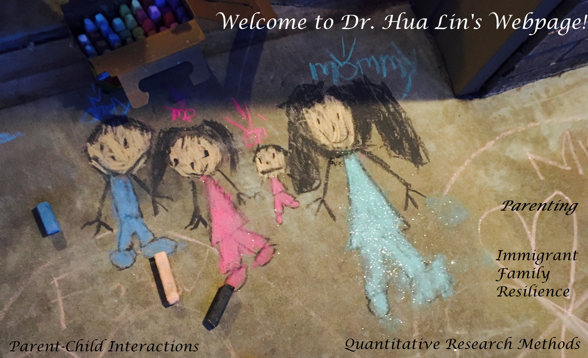

# Hua Lin, Ph.D

  
About me /About/ Research /Research/ Publications /Publications/ Workshops /Workshops/

***********

>   I am a child development and family scientist and quantitative research methodologist and serves as a post-doctoral fellow working in the Department of Human Development and Family Science at Oklahoma State University. 
>
> As a child development and family scientist, my research interests are parenting and the development of parent-child interactions, in that I am focusing on momentary parenting goals, parental competency, social withdrawal, and immigrant youth well-being. I was certified by Active Parenting in 2015 for teaching “Active parenting 4th edition” and “Parenting Your 1- to 4-Year-Old.”
>
> As a research methodologist, I am focusing on cross-cultural psychometric appropriations (including Item Response Theory), statistic model comparison (mediation moderation, propensity score matching, dual-centered ANCOVA, etc.), and making causal inferences in non-randomized studies. I have been certified by Data Carpentry to teach data management and statistic programs in Data Carpentry Workshop (e.g., Introduction to R) and Software Workshop (e.g., Python).

## Publications

> - **Lin, H.**, & Larzelere, R. E. (in press). Dual-centered ANCOVA: Resolving contradictory results from Lord’s paradox with implications for reducing bias in longitudinal analyses. *Journal of Adolescence*.
> - **Lin, H.**, Harrist, A. W., Lansford, J. E., Dodge, K. A., Bates, J. E., & Pettit, G. S. (2020). Adolescent social withdrawal, parental psychological control, and parental monitoring knowledge across seven years: A developmental cascade model. *Journal of Adolescence*, 81, 124-134.
> - **Lin, H.** (2020). Probing two-way moderation effects: A review of software to easily plot Johnson-Neyman figures. *Structural Equation Modeling: A Multidisciplinary Journal*, 27, 492-502. doi:10.1080/10705511.2020.1732826.
> - **Lin, H.,** Richie, K. L., & Larzelere, R. E. (2020). Applying a momentary parenting goal-regulation model to discipline episodes with toddlers. *Journal of Child and Family Studies*, 29, 1055–1069. doi:10.1007/s10826-020-01698-1
> - Larzelere, R.E., Gunnoe, M. L., Roberts, M. W., **Lin, H.**, Ferguson, C. J. (2020). Causal evidence for exclusively positive parenting and timeout. *Marriage & Family Review*, 56, 287-319. doi:10.1080/01494929.2020.1712304.
> - Larzelere, R. E., **Lin, H.**, Payton, M. E., & Washburn, I. J. (2018). Longitudinal biases against corrective actions. *Archives of Scientific Psychology*, 6, 243-250. doi:10.1037/arc0000052.
